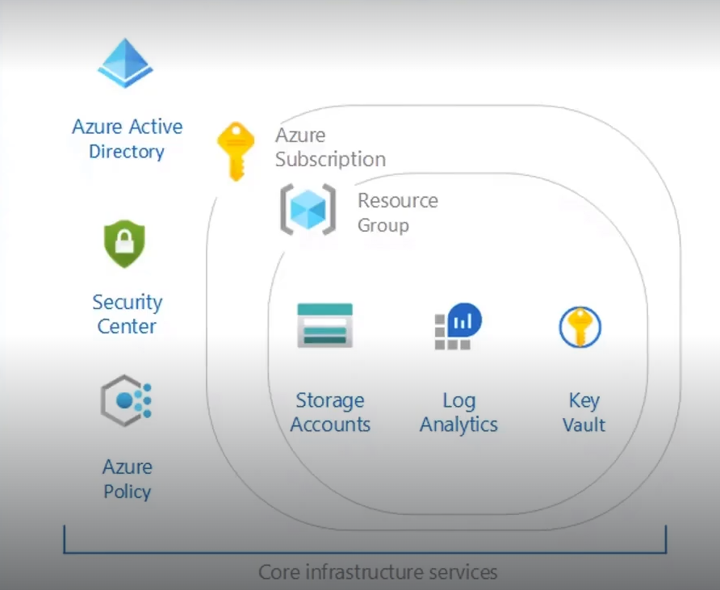

# Lab: Projeto Hands-on Azure Landing Zone

## 📝 1. Objetivo do Laboratório
O objetivo deste laboratório foi implementar uma estrutura básica de **Azure Landing Zone** seguindo as melhores práticas de arquitetura recomendadas pela Microsoft (CAF - Cloud Adoption Framework). O foco foi garantir a segregação de responsabilidades através de múltiplos Resource Groups, provisionamento de rede segura (Hub), armazenamento centralizado de logs, gerenciamento seguro de credenciais e aplicação de políticas de conformidade (governança).


## 📐 2. Arquitetura do Cenário
*O diagrama abaixo ilustra a topologia de rede e a distribuição dos recursos dentro de suas respectivas áreas de governança.*



### Componentes Utilizados:
* **Resource Groups (Segregação de Funções):**
  * `rg-labAzure-mgmt` (Gerenciamento e Governança)
  * `rg-labAzure-network` (Infraestrutura de Rede)
  * `rg-labAzure-storage` (Armazenamento de Logs)
  * `rg-labAzure-vms` (Recursos de Computação)
* **Virtual Network (VNet) & Subnets:**
  * `vnet-labAzure-hub` (Espaço de endereçamento: `10.0.0.0/16`)
    * `snet-default` (`10.0.0.0/24`)
    * `snet-frontend` (`10.0.1.0/24`)
    * `snet-backend` (`10.0.2.0/24`)
    * `snet-mgmt` (`10.0.3.0/24`)
* **Máquinas Virtuais (Computação):**
  * 1x Instância `Standard_D2s_v3` (`VM-Web`) rodando Windows Server 2022.
* **Segurança, Monitoramento e Governança:**
  * **Azure Key Vault:** `akv-labAzure` (Armazenamento seguro de segredos, chaves e certificados).
  * **Log Analytics Workspace:** `law-labAzure` (Console centralizado para análise de telemetria e logs).
  * **Storage Account:** `sa-labAzure-log` (Repositório para retenção de logs brutos de diagnóstico das VMs).
  * **Azure Policy:** Aplicação de políticas para controle e governança de recursos.


## 🚀 3. Passo a Passo Resumido

1. **Estruturação do Ambiente e Redes:**
   * Criação dos quatro Resource Groups para garantir a organização e controle de custos de forma granular.
   * Provisionamento da VNet principal (`vnet-labAzure-hub`) e segmentação das quatro sub-redes planejadas para garantir o isolamento do tráfego.

2. **Configuração de Armazenamento e Monitoramento:**
   * Provisionamento da Storage Account destinada à retenção de logs de diagnóstico.
   * Instalação do Log Analytics Workspace para consolidação das métricas de monitoramento.

3. **Gerenciamento de Segredos:**
   * Criação do Azure Key Vault para centralizar e proteger as credenciais de administrador que seriam utilizadas na criação da VM.

4. **Provisionamento da VM:**
   * Implantação da `VM-Web` dentro da sub-rede correspondente, consumindo as credenciais armazenadas de forma segura.

5. **Configuração do Servidor Web:**
   * Conexão via RDP na máquina e execução do script PowerShell para instalação do papel de servidor web (IIS) e customização da página inicial de testes.

6. **Implementação de Governança (Azure Policy):**
   * Criação e atribuição de duas políticas de conformidade no escopo da Landing Zone para garantir a organização e rastreamento de custos futuros:
     * **Require a tag and its value on resource groups:** Obriga que todo novo grupo de recursos seja criado com uma tag específica e seu respectivo valor predefinido.
     * **Require a tag and its value on resources:** Garante que os recursos individuais herdem ou sejam criados obrigatoriamente com a marcação de tags necessária para a governança do ambiente.


## 💻 4. Scripts e Comandos Úteis
Script PowerShell executado para a instalação automatizada do IIS e configuração da tela padrão com o hostname da máquina:

```powershell
# Instalação do papel de Servidor Web (IIS) com as ferramentas de gerenciamento
Install-WindowsFeature -name Web-Server -IncludeManagementTools

# Remoção do arquivo HTML padrão do IIS
Remove-Item C:\inetpub\wwwroot\iisstart.htm

# Criação de um novo arquivo de marcação exibindo dinamicamente o nome do servidor
Add-Content -Path "C:\inetpub\wwwroot\iisstart.htm" -Value $("Azure Expert VM is running " + $env:computername)
